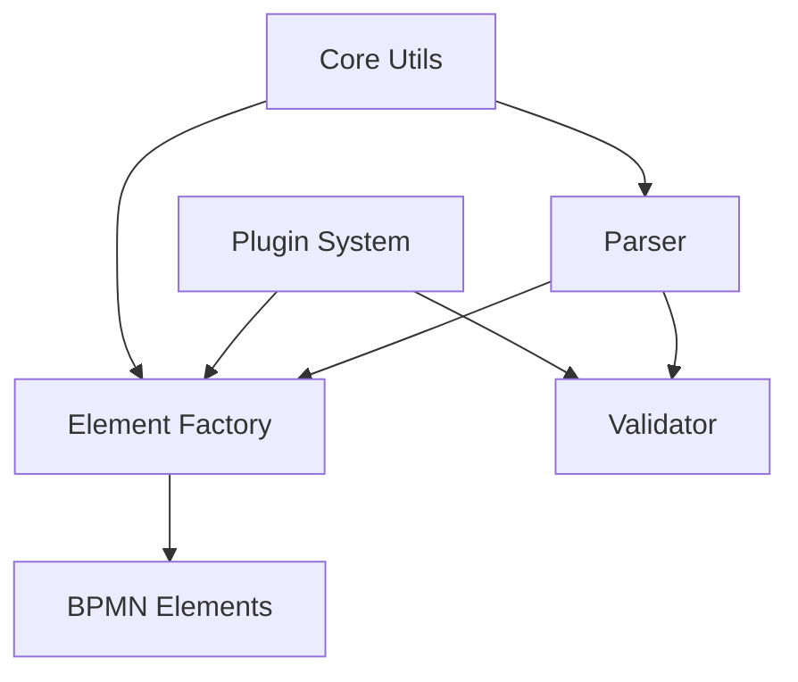
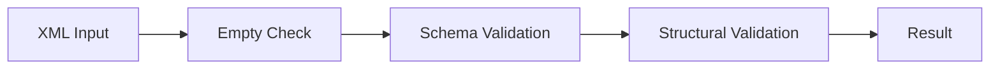
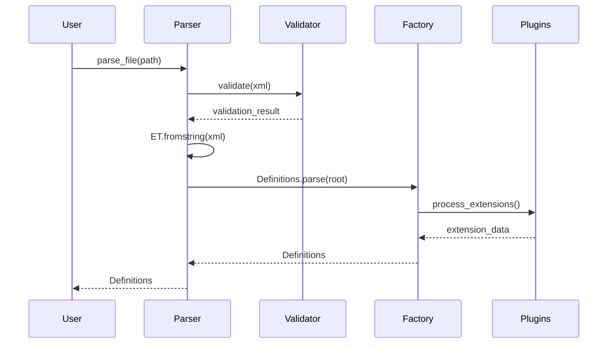

# Core Components

This document provides detailed information about PyBPMN Parser's core components and their interactions.

## Component Overview

PyBPMN Parser consists of several major components:



## Parser Component

### Main Parse Functions

The parser component provides the primary API for parsing BPMN files:

**Location**: `pybpmn_parser/parse.py`

```python
def parse(xml_str: str) -> Definitions:
    """Parse BPMN XML string into Definitions object."""

def parse_file(xml_file: Path) -> Definitions:
    """Parse BPMN XML file into Definitions object."""
```

### Parser Flow

1. **Input Validation** - Check XML is not empty
2. **Schema Validation** - Validate against BPMN 2.0 XSD
3. **XML Parsing** - Parse XML using lxml
4. **Element Construction** - Create typed BPMN elements
5. **Plugin Processing** - Apply registered plugins
6. **Return Definitions** - Return root Definitions object

### Implementation Details

The parser uses lxml for XML processing:

```python
import lxml.etree as ET

def parse(xml_str: str) -> Definitions:
    # Validate first
    validation_result = validate(xml_str)
    validation_result.raise_for_errors()

    # Parse XML
    root: ET.Element = ET.fromstring(xml_str.encode("utf-8"))

    # Create Definitions object
    return Definitions.parse(root)
```

## Element Factory

### Purpose

The element factory creates typed Python dataclasses from XML elements.

### Class Hierarchy

BPMN elements follow the BPMN 2.0 specification hierarchy:

```
BaseElement
├── FlowElement
│   ├── FlowNode
│   │   ├── Activity
│   │   │   ├── Task
│   │   │   ├── SubProcess
│   │   │   └── CallActivity
│   │   ├── Event
│   │   │   ├── StartEvent
│   │   │   ├── EndEvent
│   │   │   └── IntermediateEvent
│   │   └── Gateway
│   │       ├── ExclusiveGateway
│   │       ├── ParallelGateway
│   │       └── InclusiveGateway
│   └── SequenceFlow
├── Artifact
│   ├── TextAnnotation
│   ├── Group
│   └── Association
└── DataObject
```

### Element Construction

Elements are constructed using dataclasses:

```python
from dataclasses import dataclass
from typing import Optional, List

@dataclass
class Task(FlowNode):
    """BPMN Task element."""

    id: str
    name: Optional[str] = None
    documentation: List[Documentation] = field(default_factory=list)
    is_for_compensation: bool = False

    @classmethod
    def parse(cls, element: ET.Element) -> "Task":
        """Parse Task from XML element."""
        return cls(
            id=element.get("id"),
            name=element.get("name"),
            # ... parse other attributes
        )
```

## Validator Component

### Purpose

The validator ensures BPMN documents conform to the BPMN 2.0 specification.

**Location**: `pybpmn_parser/validator.py`

### Validation Process



### Validation Rules

1. **Empty XML Check** - Ensure input is not empty
2. **Schema Validation** - Validate against BPMN 2.0 XSD
3. **Element Validation** - Check required attributes
4. **Reference Validation** - Verify ID references exist

### Usage

```python
from pybpmn_parser.validator import validate

result = validate(xml_string)

if result.errors:
    for error in result.errors:
        print(f"Validation error: {error}")
else:
    print("Valid BPMN")
```

## BPMN Elements

### Organization

BPMN elements are organized by category:

```
pybpmn_parser/bpmn/
├── activities/       # Tasks, SubProcesses
├── events/          # Start, End, Intermediate Events
├── gateways/        # Exclusive, Parallel, Inclusive
├── common/          # Shared base classes
├── foundation/      # Base BPMN elements
├── infrastructure/  # Definitions, Process
└── collaboration/   # Pools, Lanes, Message Flows
```

### Dataclass Design

Elements use Python dataclasses for type safety:

```python
@dataclass
class StartEvent(Event):
    """BPMN Start Event."""

    id: str
    name: Optional[str] = None
    is_interrupting: bool = True
    event_definitions: List[EventDefinition] = field(default_factory=list)
```

### Benefits

- **Type Safety** - IDE support and type checking
- **Immutability Options** - Can make dataclasses frozen
- **Default Values** - Clean handling of optional attributes
- **Auto-generated Methods** - `__init__`, `__repr__`, `__eq__`

## Plugin System

### Architecture

The plugin system allows extensions without modifying core code.

**Location**: `pybpmn_parser/plugins/`

### Plugin Registry

```python
class PluginRegistry:
    """Central registry for plugins."""

    def __init__(self):
        self._plugins = []

    def register(self, plugin):
        """Register a plugin."""
        self._plugins.append(plugin)

    def get_plugins(self):
        """Get all registered plugins."""
        return self._plugins
```

### Plugin Interface

Plugins implement standard methods:

```python
class Plugin:
    """Base plugin interface."""

    namespaces: dict

    def parse_extension(self, element, extension_data):
        """Parse extension attributes."""
        raise NotImplementedError

    def validate_extension(self, element, extension_data):
        """Validate extension attributes."""
        return []
```

### Extension Processing

1. **Namespace Detection** - Identify which plugins handle which namespaces
2. **Attribute Extraction** - Extract attributes for each namespace
3. **Plugin Invocation** - Call appropriate plugin methods
4. **Extension Attachment** - Attach parsed data to elements

## Core Utilities

### Purpose

Core utilities provide shared functionality across components.

**Location**: `pybpmn_parser/core.py`

### Utility Functions

```python
def strtobool(value: str) -> bool:
    """Convert string to boolean."""
    value = str(value).lower()
    return value in ("y", "yes", "on", "1", "true", "t")

def get_fields_by_metadata(data_class, key, val):
    """Get dataclass fields by metadata."""
    # Implementation
```

## Data Flow

### Parse Flow



### Element Creation Flow

1. **XML Element** - Start with lxml Element
2. **Attribute Extraction** - Extract XML attributes
3. **Child Processing** - Recursively process children
4. **Extension Processing** - Apply plugins
5. **Dataclass Construction** - Create typed Python object

## Performance Considerations

### XML Parsing

- Uses lxml (C-based) for fast parsing
- Parses entire document into memory (not streaming)
- Suitable for documents up to ~100MB

### Memory Usage

- One Python object per BPMN element
- Lightweight dataclasses minimize overhead
- References use IDs (strings) not object pointers

### Optimization Strategies

```python
# Cache parsed results
from functools import lru_cache

@lru_cache(maxsize=100)
def cached_parse(file_path: str):
    return parse_file(Path(file_path))
```

## Extension Points

### For Plugin Developers

1. **Namespace Handler** - Add support for new namespaces
2. **Custom Validator** - Add validation rules
3. **Element Extensions** - Extend element classes

### For Library Users

1. **Custom Element Factories** - Override element creation
2. **Validation Callbacks** - Add custom validation
3. **Post-Processing Hooks** - Process after parsing

## Error Handling

### Exception Hierarchy

```python
BPMNParserError
├── ValidationError
│   ├── SchemaError
│   ├── EmptyXMLError
│   └── StructuralError
└── ParseError
    ├── MalformedXMLError
    └── UnknownElementError
```

### Error Recovery

The parser uses fail-fast approach:
- Validation errors stop parsing
- Schema violations raise immediately
- No partial/invalid results returned

## Testing Strategy

### Unit Tests

Each component has isolated unit tests:

```python
# tests/test_parse.py
def test_parse_valid_bpmn():
    xml = """<definitions>...</definitions>"""
    result = parse(xml)
    assert isinstance(result, Definitions)
```

### Integration Tests

Test component interactions:

```python
# tests/test_integration.py
def test_parse_with_plugins():
    register_plugin(MyPlugin())
    result = parse_file(Path("extended.bpmn"))
    assert result.processes[0].flow_elements
```

### Fixture-based Tests

Use real BPMN files:

```python
def test_miwg_suite(miwg_file):
    result = parse_file(miwg_file)
    assert result.processes
```

## Design Decisions

### Why Dataclasses?

**Chosen**: Python dataclasses
**Alternatives Considered**: Plain classes, attrs, Pydantic

**Rationale**:
- Built-in to Python 3.7+
- Minimal boilerplate
- Good IDE support
- Type hints integration

### Why lxml?

**Chosen**: lxml
**Alternatives Considered**: xml.etree, xmltodict

**Rationale**:
- Fast C-based parser
- XPath support
- Schema validation
- Industry standard

### Why Plugins?

**Chosen**: Plugin architecture
**Alternatives Considered**: Inheritance, monkey-patching

**Rationale**:
- Extensible without modification
- Clean separation of concerns
- Optional functionality
- Community contributions
