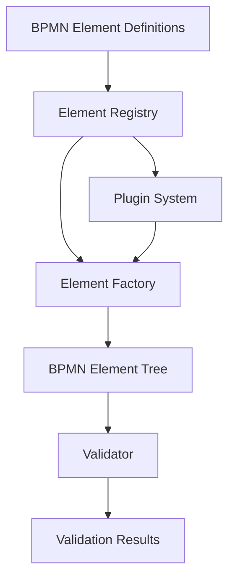

# Architecture Overview

This section provides a deep dive into PyBPMN Parser's architecture, design decisions, and internal components.

## System Overview

PyBPMN Parser is designed with several key principles:

- **Simplicity** - Easy to use API with sensible defaults
- **Extensibility** - Plugin system for custom extensions
- **Type Safety** - Comprehensive type hints and dataclasses
- **Performance** - Efficient parsing and element access

## High-Level Architecture

## Core Components

PyBPMN Parser consists of several interconnected components:

1. **Parser** (`pybpmn_parser.parse`) - Main entry point for parsing BPMN files
2. **Core** (`pybpmn_parser.core`) - Core parsing logic and XML handling
3. **Elements** (`pybpmn_parser.bpmn`) - BPMN element class definitions
4. **Validator** (`pybpmn_parser.validator`) - Document validation framework
5. **Plugin System** (`pybpmn_parser.plugins`) - Extension and plugin management

## Data Flow

1. **Input** - BPMN XML file or string
2. **Parsing** - XML parsing with lxml
3. **Element Construction** - Creating typed BPMN elements
4. **Extension Processing** - Plugin-based attribute extraction
5. **Validation** - Optional validation checks
6. **Output** - Structured BPMN element tree

## Extension Points

The library provides several extension points:

- **Plugins** - Add support for vendor extensions
- **Custom Validators** - Implement domain-specific validation
- **Element Factories** - Override element creation logic

## Performance Considerations

- Uses lxml for fast XML parsing
- Lazy loading of element relationships where possible
- Efficient namespace handling
- Minimal memory overhead

## Design Decisions

### Why Dataclasses?

We use Python dataclasses for BPMN elements because:

- Clear, typed attribute definitions
- Automatic `__init__`, `__repr__`, and `__eq__` methods
- Better IDE support and type checking
- Immutability options for safety

### Why a Plugin System?

The plugin system allows:

- Clean separation of core and vendor-specific code
- Easy addition of new vendor support
- Community contributions without core changes
- Optional loading of extensions

## Next Steps

- Explore [Core Components](components.md) for detailed technical information
- Review the [API Reference](../reference/index.md) for implementation details
- Check out [Plugin Development](../plugins/index.md) to extend the library
